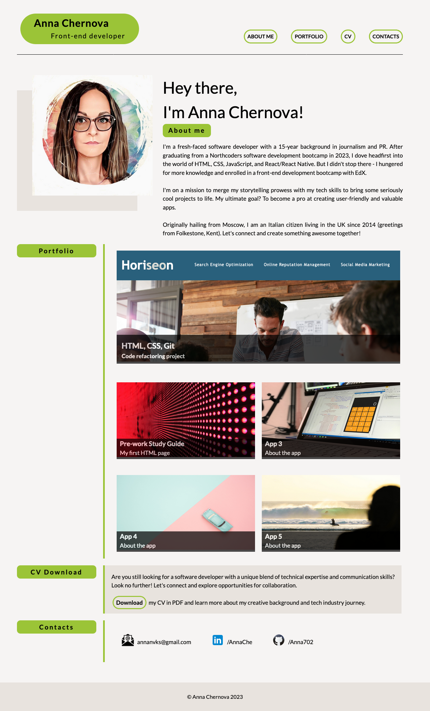

# Portfolio Page

## Description

This repo was created to assist me in improving proficiency in flexbox, grid and CSS variables by developing a personal portfolio page.

- When the page is loaded the page presents my name, an avatar and links to sections about me, my portfolio and how to contact me.

- When one of the links in the navigation is clicked then the UI scrolls to the corresponding section.

- When viewing the section about my work then the section contains titled images of applications.

- When presented with the first application then that application's image is larger in size than the others.

- When images of the applications are clicked then the user is taken to that deployed application.

## Credits

Email, LinkedIn and GitHub Icons - [icons](https://icons8.com/icons).

Quite helpful [Markdown-Cheatsheet](https://github.com/lifeparticle/Markdown-Cheatsheet).

## Project Status

Deployed: https://anna702.github.io/portfolio_page/

## Project Screenshot

## License

MIT License

## Q&A

In case you have any questions, feel free to contact me at <a href="mailto:annanvks@gmail.com?">annanvks@gmail.com</a>.
